# Dev-Team: Dependency & Workflow Diagrams

Visual mapping of all agents, commands, and their dependencies in the `dev-team/` plugin.

## Table of Contents

| # | Section | Description |
|---|---------|-------------|
| 1 | [Visual Conventions](#1-visual-conventions) | Colors, shapes, and line styles |
| 2 | [Ecosystem Overview](#2-ecosystem-overview) | Commands -> Skills -> Agents |
| 3 | [Agent Dependencies](#3-agent-dependency-diagrams) | Per-agent dependency graphs (11) |
| 4 | [Command Workflows](#4-command-workflow-diagrams) | Per-command flowcharts (7) |
| 5 | [Gate 0 Dispatch Logic](#5-gate-0-agent-dispatch-logic) | Language detection decision tree |
| 6 | [Agent Handoff Contracts](#6-agent-handoff-contracts) | Data flow between agents |

---

## 1. Visual Conventions

| Element | Shape | Color | Meaning |
|---------|-------|-------|---------|
| Agent | Rounded rectangle | Blue `#4a90d9` | Executor (implements/validates) |
| Skill | Rectangle | Gray `#6c757d` | Orchestrator (loads instructions) |
| Command | Stadium `([...])` | Teal `#17a2b8` | Entry point (user invocation) |
| Standards file | Rectangle | Orange `#f5a623` | WebFetch-loaded standards |
| Shared pattern | Hexagon | Green `#7ed321` | Referenced markdown pattern |
| Decision | Diamond `{...}` | Yellow `#ffc107` | Conditional branch |
| Project file | Parallelogram | Pink `#e91e63` | Local project file |

| Line Style | Meaning |
|------------|---------|
| Solid arrow `-->` | Mandatory dependency |
| Dashed arrow `-.->` | Conditional dependency |
| Dotted arrow `...>` | Delegation / handoff |
| Bold label on edge | Condition that triggers the dependency |

---

## 2. Ecosystem Overview

High-level view: Commands invoke Skills, which dispatch Agents.

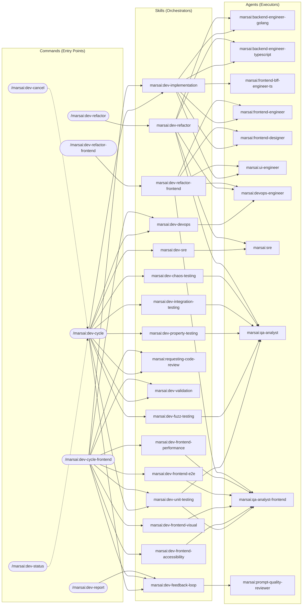
```mermaid
flowchart LR
    subgraph Commands["Commands (Entry Points)"]
        dc(["/marsai:dev-cycle"])
        dcf(["/marsai:dev-cycle-frontend"])
        dr(["/marsai:dev-refactor"])
        drf(["/marsai:dev-refactor-frontend"])
        ds(["/marsai:dev-status"])
        dcancel(["/marsai:dev-cancel"])
        dreport(["/marsai:dev-report"])
    end

    subgraph Skills["Skills (Orchestrators)"]
        impl["marsai:dev-implementation"]
        devops_s["marsai:dev-devops"]
        sre_s["marsai:dev-sre"]
        unit["marsai:dev-unit-testing"]
        fuzz["marsai:dev-fuzz-testing"]
        prop["marsai:dev-property-testing"]
        integ["marsai:dev-integration-testing"]
        chaos["marsai:dev-chaos-testing"]
        review["marsai:requesting-code-review"]
        valid["marsai:dev-validation"]
        a11y["marsai:dev-frontend-accessibility"]
        visual["marsai:dev-frontend-visual"]
        e2e["marsai:dev-frontend-e2e"]
        perf["marsai:dev-frontend-performance"]
        refactor_s["marsai:dev-refactor"]
        refactorFE_s["marsai:dev-refactor-frontend"]
        feedback["marsai:dev-feedback-loop"]
    end

    subgraph Agents["Agents (Executors)"]
        goEng["marsai:backend-engineer-golang"]
        tsEng["marsai:backend-engineer-typescript"]
        bffEng["marsai:frontend-bff-engineer-ts"]
        feEng["marsai:frontend-engineer"]
        feDes["marsai:frontend-designer"]
        uiEng["marsai:ui-engineer"]
        devopsA["marsai:devops-engineer"]
        sreA["marsai:sre"]
        qaA["marsai:qa-analyst"]
        qaFE["marsai:qa-analyst-frontend"]
        pqr["marsai:prompt-quality-reviewer"]
    end

    dc --> impl & devops_s & sre_s & unit & fuzz & prop & integ & chaos & review & valid
    dcf --> impl & devops_s & a11y & unit & visual & e2e & perf & review & valid
    dr --> refactor_s
    drf --> refactorFE_s

    impl --> goEng & tsEng & bffEng & feEng & feDes & uiEng
    devops_s --> devopsA
    sre_s --> sreA
    unit --> qaA & qaFE
    fuzz --> qaA
    prop --> qaA
    integ --> qaA
    chaos --> qaA
    a11y --> qaFE
    visual --> qaFE
    e2e --> qaFE
    perf --> qaFE
    refactor_s --> goEng & tsEng & devopsA & sreA & qaA
    refactorFE_s --> feEng & feDes & uiEng & qaFE & devopsA

    dc & dcf --> feedback
    feedback --> pqr

    ds -.-> dc
    dcancel -.-> dc
    dreport --> feedback
```

---

## 3. Agent Dependency Diagrams

### 3.1 marsai:backend-engineer-golang

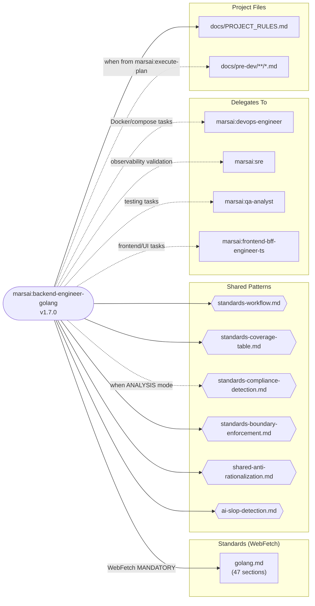
```mermaid
flowchart LR
    agent(["marsai:backend-engineer-golang<br/>v1.7.0"])

    subgraph Standards["Standards (WebFetch)"]
        golang["golang.md<br/>(47 sections)"]
    end

    subgraph SharedPatterns["Shared Patterns"]
        sw{{"standards-workflow.md"}}
        sct{{"standards-coverage-table.md"}}
        scd{{"standards-compliance-detection.md"}}
        sbe{{"standards-boundary-enforcement.md"}}
        sar{{"shared-anti-rationalization.md"}}
        asd{{"ai-slop-detection.md"}}
    end

    subgraph Delegates["Delegates To"]
        devops["marsai:devops-engineer"]
        sre["marsai:sre"]
        qa["marsai:qa-analyst"]
        bff["marsai:frontend-bff-engineer-ts"]
    end

    subgraph ProjectFiles["Project Files"]
        pr["docs/PROJECT_RULES.md"]
        predev["docs/pre-dev/**/*.md"]
    end

    agent -->|"WebFetch MANDATORY"| golang
    agent --> sw & sct & sar & asd & sbe
    agent -.->|"when ANALYSIS mode"| scd
    agent -.->|"Docker/compose tasks"| devops
    agent -.->|"observability validation"| sre
    agent -.->|"testing tasks"| qa
    agent -.->|"frontend/UI tasks"| bff
    agent --> pr
    agent -.->|"when from marsai:execute-plan"| predev
```

### 3.2 marsai:backend-engineer-typescript

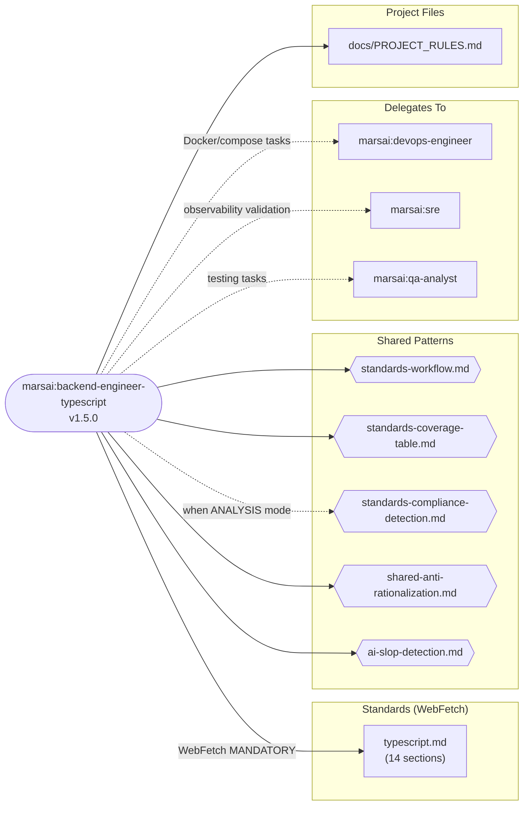
```mermaid
flowchart LR
    agent(["marsai:backend-engineer-typescript<br/>v1.5.0"])

    subgraph Standards["Standards (WebFetch)"]
        ts["typescript.md<br/>(14 sections)"]
    end

    subgraph SharedPatterns["Shared Patterns"]
        sw{{"standards-workflow.md"}}
        sct{{"standards-coverage-table.md"}}
        scd{{"standards-compliance-detection.md"}}
        sar{{"shared-anti-rationalization.md"}}
        asd{{"ai-slop-detection.md"}}
    end

    subgraph Delegates["Delegates To"]
        devops["marsai:devops-engineer"]
        sre["marsai:sre"]
        qa["marsai:qa-analyst"]
    end

    subgraph ProjectFiles["Project Files"]
        pr["docs/PROJECT_RULES.md"]
    end

    agent -->|"WebFetch MANDATORY"| ts
    agent --> sw & sct & sar & asd
    agent -.->|"when ANALYSIS mode"| scd
    agent -.->|"Docker/compose tasks"| devops
    agent -.->|"observability validation"| sre
    agent -.->|"testing tasks"| qa
    agent --> pr
```

### 3.3 marsai:frontend-bff-engineer-typescript

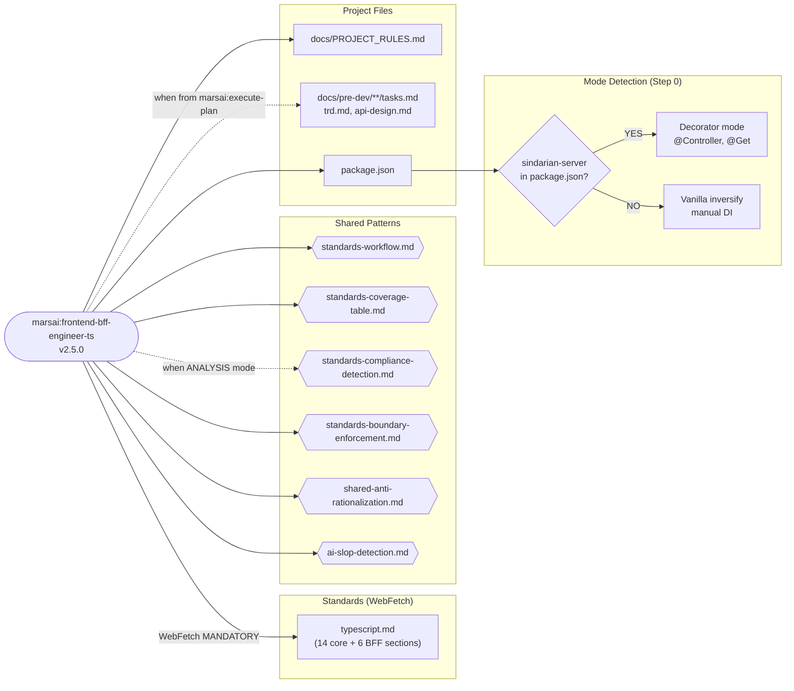
```mermaid
flowchart LR
    agent(["marsai:frontend-bff-engineer-ts<br/>v2.5.0"])

    subgraph Standards["Standards (WebFetch)"]
        ts["typescript.md<br/>(14 core + 6 BFF sections)"]
    end

    subgraph SharedPatterns["Shared Patterns"]
        sw{{"standards-workflow.md"}}
        sct{{"standards-coverage-table.md"}}
        scd{{"standards-compliance-detection.md"}}
        sbe{{"standards-boundary-enforcement.md"}}
        sar{{"shared-anti-rationalization.md"}}
        asd{{"ai-slop-detection.md"}}
    end

    subgraph ProjectFiles["Project Files"]
        pr["docs/PROJECT_RULES.md"]
        predev["docs/pre-dev/**/tasks.md<br/>trd.md, api-design.md"]
        pkg["package.json"]
    end

    subgraph ModeDetection["Mode Detection (Step 0)"]
        mode{"sindarian-server<br/>in package.json?"}
        deco["Decorator mode<br/>@Controller, @Get"]
        vanilla["Vanilla inversify<br/>manual DI"]
    end

    agent -->|"WebFetch MANDATORY"| ts
    agent --> sw & sct & sar & asd & sbe
    agent -.->|"when ANALYSIS mode"| scd
    agent --> pr
    agent -.->|"when from marsai:execute-plan"| predev
    agent --> pkg
    pkg --> mode
    mode -->|"YES"| deco
    mode -->|"NO"| vanilla
```

### 3.4 marsai:frontend-engineer

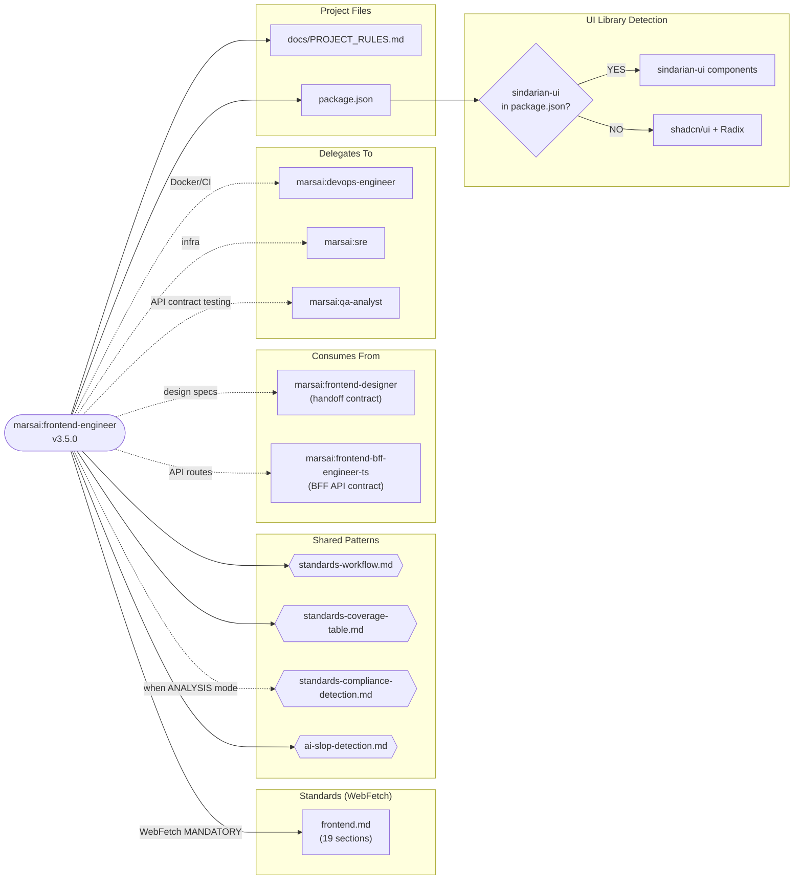
```mermaid
flowchart LR
    agent(["marsai:frontend-engineer<br/>v3.5.0"])

    subgraph Standards["Standards (WebFetch)"]
        fe["frontend.md<br/>(19 sections)"]
    end

    subgraph SharedPatterns["Shared Patterns"]
        sw{{"standards-workflow.md"}}
        sct{{"standards-coverage-table.md"}}
        scd{{"standards-compliance-detection.md"}}
        asd{{"ai-slop-detection.md"}}
    end

    subgraph Consumes["Consumes From"]
        designer["marsai:frontend-designer<br/>(handoff contract)"]
        bff["marsai:frontend-bff-engineer-ts<br/>(BFF API contract)"]
    end

    subgraph Delegates["Delegates To"]
        devops["marsai:devops-engineer"]
        sre["marsai:sre"]
        qa["marsai:qa-analyst"]
    end

    subgraph ProjectFiles["Project Files"]
        pr["docs/PROJECT_RULES.md"]
        pkg["package.json"]
    end

    subgraph ModeDetection["UI Library Detection"]
        mode{"sindarian-ui<br/>in package.json?"}
        sindarian["sindarian-ui components"]
        shadcn["shadcn/ui + Radix"]
    end

    agent -->|"WebFetch MANDATORY"| fe
    agent --> sw & sct & asd
    agent -.->|"when ANALYSIS mode"| scd
    agent -.->|"design specs"| designer
    agent -.->|"API routes"| bff
    agent -.->|"Docker/CI"| devops
    agent -.->|"infra"| sre
    agent -.->|"API contract testing"| qa
    agent --> pr & pkg
    pkg --> mode
    mode -->|"YES"| sindarian
    mode -->|"NO"| shadcn
```

### 3.5 marsai:frontend-designer

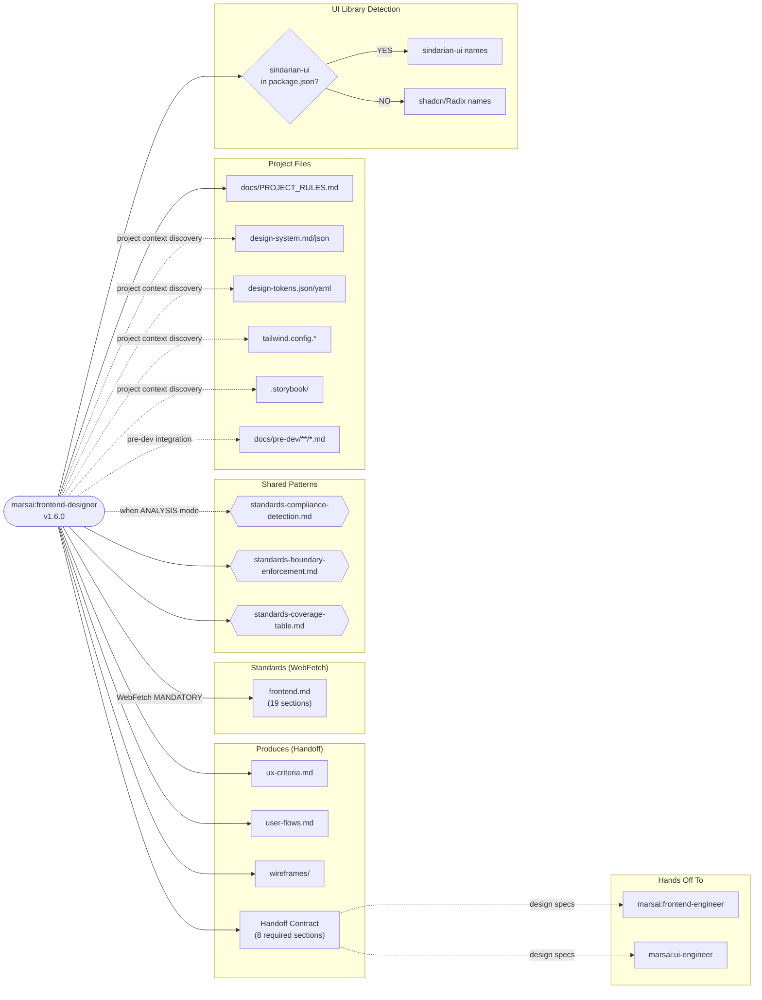
```mermaid
flowchart LR
    agent(["marsai:frontend-designer<br/>v1.6.0"])

    subgraph Standards["Standards (WebFetch)"]
        fe["frontend.md<br/>(19 sections)"]
    end

    subgraph SharedPatterns["Shared Patterns"]
        scd{{"standards-compliance-detection.md"}}
        sbe{{"standards-boundary-enforcement.md"}}
        sct{{"standards-coverage-table.md"}}
    end

    subgraph Produces["Produces (Handoff)"]
        ux["ux-criteria.md"]
        flows["user-flows.md"]
        wire["wireframes/"]
        handoff["Handoff Contract<br/>(8 required sections)"]
    end

    subgraph HandoffTo["Hands Off To"]
        feEng["marsai:frontend-engineer"]
        uiEng["marsai:ui-engineer"]
    end

    subgraph ProjectFiles["Project Files"]
        pr["docs/PROJECT_RULES.md"]
        ds["design-system.md/json"]
        dt["design-tokens.json/yaml"]
        tw["tailwind.config.*"]
        sb[".storybook/"]
        predev["docs/pre-dev/**/*.md"]
    end

    subgraph ModeDetection["UI Library Detection"]
        mode{"sindarian-ui<br/>in package.json?"}
        sindarian["sindarian-ui names"]
        shadcn["shadcn/Radix names"]
    end

    agent -->|"WebFetch MANDATORY"| fe
    agent --> sct
    agent -.->|"when ANALYSIS mode"| scd
    agent --> sbe
    agent --> pr
    agent -.->|"project context discovery"| ds & dt & tw & sb
    agent -.->|"pre-dev integration"| predev
    agent --> ux & flows & wire & handoff
    handoff ...->|"design specs"| feEng
    handoff ...->|"design specs"| uiEng
    agent --> mode
    mode -->|"YES"| sindarian
    mode -->|"NO"| shadcn
```

### 3.6 marsai:ui-engineer

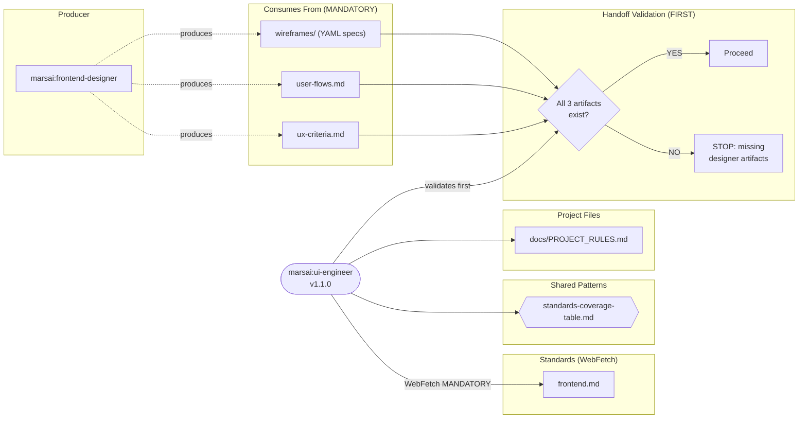
```mermaid
flowchart LR
    agent(["marsai:ui-engineer<br/>v1.1.0"])

    subgraph Standards["Standards (WebFetch)"]
        fe["frontend.md"]
    end

    subgraph SharedPatterns["Shared Patterns"]
        sct{{"standards-coverage-table.md"}}
    end

    subgraph ConsumesFrom["Consumes From (MANDATORY)"]
        ux["ux-criteria.md"]
        flows["user-flows.md"]
        wire["wireframes/ (YAML specs)"]
    end

    subgraph Producer["Producer"]
        designer["marsai:frontend-designer"]
    end

    subgraph ProjectFiles["Project Files"]
        pr["docs/PROJECT_RULES.md"]
    end

    subgraph Validation["Handoff Validation (FIRST)"]
        check{"All 3 artifacts<br/>exist?"}
        proceed["Proceed"]
        block["STOP: missing<br/>designer artifacts"]
    end

    agent -->|"WebFetch MANDATORY"| fe
    agent --> sct
    agent --> pr
    designer ...->|"produces"| ux & flows & wire
    agent -->|"validates first"| check
    ux & flows & wire --> check
    check -->|"YES"| proceed
    check -->|"NO"| block
```

### 3.7 marsai:devops-engineer

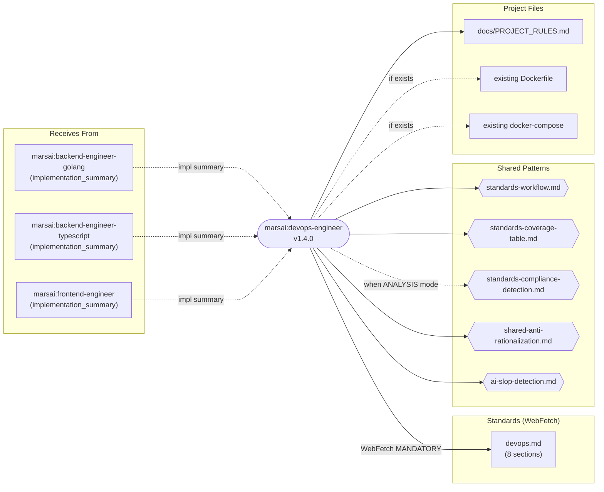
```mermaid
flowchart LR
    agent(["marsai:devops-engineer<br/>v1.4.0"])

    subgraph Standards["Standards (WebFetch)"]
        devops["devops.md<br/>(8 sections)"]
    end

    subgraph SharedPatterns["Shared Patterns"]
        sw{{"standards-workflow.md"}}
        sct{{"standards-coverage-table.md"}}
        scd{{"standards-compliance-detection.md"}}
        sar{{"shared-anti-rationalization.md"}}
        asd{{"ai-slop-detection.md"}}
    end

    subgraph ReceivesFrom["Receives From"]
        goEng["marsai:backend-engineer-golang<br/>(implementation_summary)"]
        tsEng["marsai:backend-engineer-typescript<br/>(implementation_summary)"]
        feEng["marsai:frontend-engineer<br/>(implementation_summary)"]
    end

    subgraph ProjectFiles["Project Files"]
        pr["docs/PROJECT_RULES.md"]
        dockerfile["existing Dockerfile"]
        compose["existing docker-compose"]
    end

    agent -->|"WebFetch MANDATORY"| devops
    agent --> sw & sct & sar & asd
    agent -.->|"when ANALYSIS mode"| scd
    agent --> pr
    goEng ...->|"impl summary"| agent
    tsEng ...->|"impl summary"| agent
    feEng ...->|"impl summary"| agent
    agent -.->|"if exists"| dockerfile & compose
```

### 3.8 marsai:sre

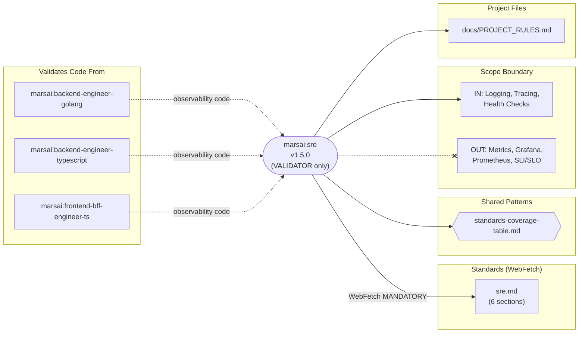
```mermaid
flowchart LR
    agent(["marsai:sre<br/>v1.5.0<br/>(VALIDATOR only)"])

    subgraph Standards["Standards (WebFetch)"]
        sre["sre.md<br/>(6 sections)"]
    end

    subgraph SharedPatterns["Shared Patterns"]
        sct{{"standards-coverage-table.md"}}
    end

    subgraph Validates["Validates Code From"]
        goEng["marsai:backend-engineer-golang"]
        tsEng["marsai:backend-engineer-typescript"]
        bffEng["marsai:frontend-bff-engineer-ts"]
    end

    subgraph Scope["Scope Boundary"]
        inScope["IN: Logging, Tracing,<br/>Health Checks"]
        outScope["OUT: Metrics, Grafana,<br/>Prometheus, SLI/SLO"]
    end

    subgraph ProjectFiles["Project Files"]
        pr["docs/PROJECT_RULES.md"]
    end

    agent -->|"WebFetch MANDATORY"| sre
    agent --> sct
    agent --> pr
    goEng ...->|"observability code"| agent
    tsEng ...->|"observability code"| agent
    bffEng ...->|"observability code"| agent
    agent --> inScope
    agent -.-x outScope
```

### 3.9 marsai:qa-analyst

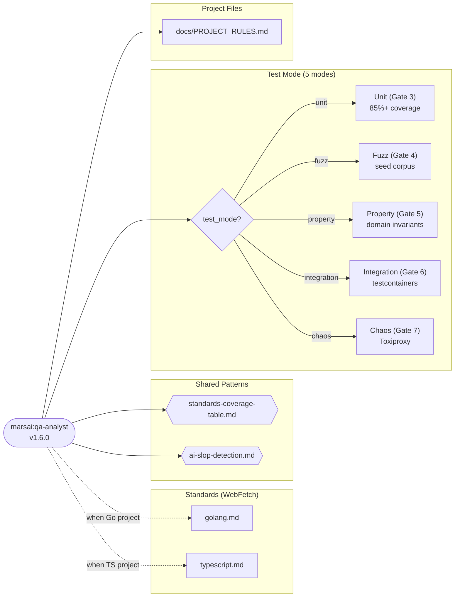
```mermaid
flowchart LR
    agent(["marsai:qa-analyst<br/>v1.6.0"])

    subgraph Standards["Standards (WebFetch)"]
        golang["golang.md"]
        ts["typescript.md"]
    end

    subgraph SharedPatterns["Shared Patterns"]
        sct{{"standards-coverage-table.md"}}
        asd{{"ai-slop-detection.md"}}
    end

    subgraph TestModes["Test Mode (5 modes)"]
        mode{"test_mode?"}
        unit["Unit (Gate 3)<br/>85%+ coverage"]
        fuzzM["Fuzz (Gate 4)<br/>seed corpus"]
        propM["Property (Gate 5)<br/>domain invariants"]
        integM["Integration (Gate 6)<br/>testcontainers"]
        chaosM["Chaos (Gate 7)<br/>Toxiproxy"]
    end

    subgraph ProjectFiles["Project Files"]
        pr["docs/PROJECT_RULES.md"]
    end

    agent -.->|"when Go project"| golang
    agent -.->|"when TS project"| ts
    agent --> sct & asd
    agent --> pr
    agent --> mode
    mode -->|"unit"| unit
    mode -->|"fuzz"| fuzzM
    mode -->|"property"| propM
    mode -->|"integration"| integM
    mode -->|"chaos"| chaosM
```

### 3.10 marsai:qa-analyst-frontend

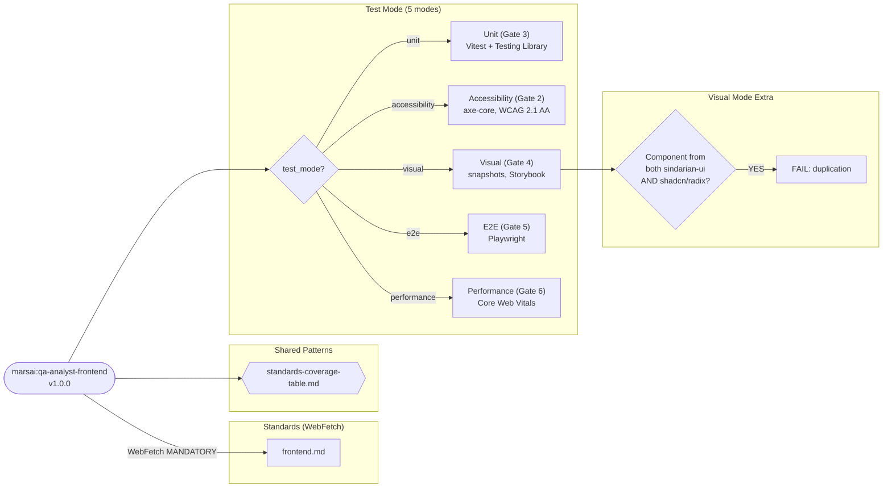
```mermaid
flowchart LR
    agent(["marsai:qa-analyst-frontend<br/>v1.0.0"])

    subgraph Standards["Standards (WebFetch)"]
        fe["frontend.md"]
    end

    subgraph SharedPatterns["Shared Patterns"]
        sct{{"standards-coverage-table.md"}}
    end

    subgraph TestModes["Test Mode (5 modes)"]
        mode{"test_mode?"}
        unit["Unit (Gate 3)<br/>Vitest + Testing Library"]
        a11y["Accessibility (Gate 2)<br/>axe-core, WCAG 2.1 AA"]
        visual["Visual (Gate 4)<br/>snapshots, Storybook"]
        e2e["E2E (Gate 5)<br/>Playwright"]
        perf["Performance (Gate 6)<br/>Core Web Vitals"]
    end

    subgraph DupCheck["Visual Mode Extra"]
        dup{"Component from<br/>both sindarian-ui<br/>AND shadcn/radix?"}
        fail["FAIL: duplication"]
    end

    agent -->|"WebFetch MANDATORY"| fe
    agent --> sct
    agent --> mode
    mode -->|"unit"| unit
    mode -->|"accessibility"| a11y
    mode -->|"visual"| visual
    mode -->|"e2e"| e2e
    mode -->|"performance"| perf
    visual --> dup
    dup -->|"YES"| fail
```

### 3.11 marsai:prompt-quality-reviewer

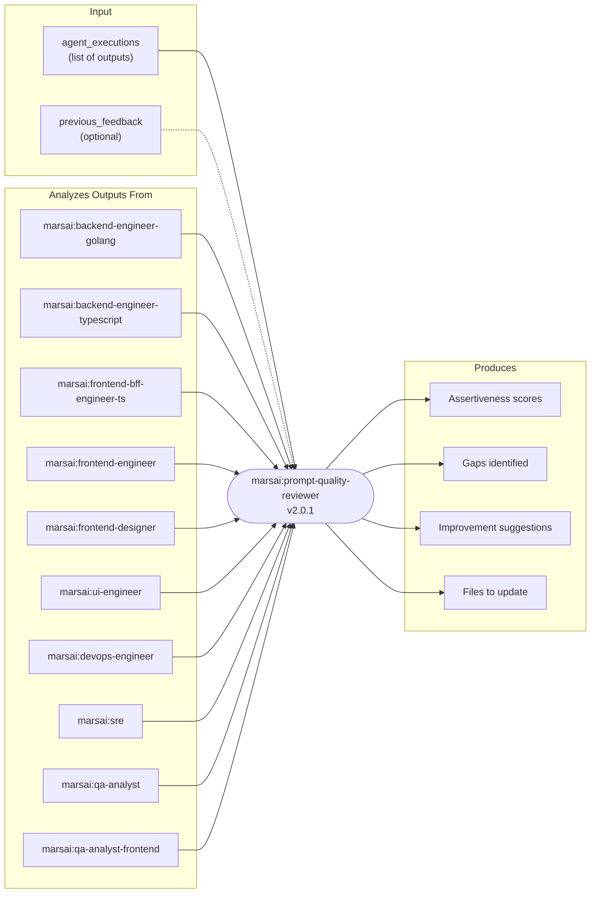
```mermaid
flowchart LR
    agent(["marsai:prompt-quality-reviewer<br/>v2.0.1"])

    subgraph Analyzes["Analyzes Outputs From"]
        goEng["marsai:backend-engineer-golang"]
        tsEng["marsai:backend-engineer-typescript"]
        bffEng["marsai:frontend-bff-engineer-ts"]
        feEng["marsai:frontend-engineer"]
        feDes["marsai:frontend-designer"]
        uiEng["marsai:ui-engineer"]
        devopsA["marsai:devops-engineer"]
        sreA["marsai:sre"]
        qaA["marsai:qa-analyst"]
        qaFE["marsai:qa-analyst-frontend"]
    end

    subgraph Produces["Produces"]
        scores["Assertiveness scores"]
        gaps["Gaps identified"]
        suggestions["Improvement suggestions"]
        files["Files to update"]
    end

    subgraph Input["Input"]
        executions["agent_executions<br/>(list of outputs)"]
        prev["previous_feedback<br/>(optional)"]
    end

    executions --> agent
    prev -.-> agent
    goEng & tsEng & bffEng & feEng --> agent
    feDes & uiEng & devopsA & sreA --> agent
    qaA & qaFE --> agent
    agent --> scores & gaps & suggestions & files
```

---

## 4. Command Workflow Diagrams

### 4.1 /marsai:dev-cycle (10 gates - Backend)

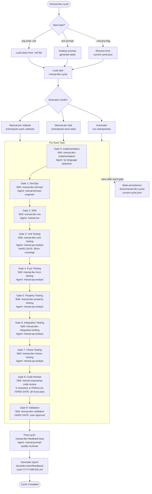
```mermaid
flowchart TD
    start(["/marsai:dev-cycle"])

    parse{"Input type?"}
    loadFile["Load tasks from .md file"]
    parsePrompt["Analyze prompt,<br/>generate tasks"]
    resumeState["Resume from<br/>current-cycle.json"]

    loadSkill["Load skill:<br/>marsai:dev-cycle"]

    askMode{"Execution mode?"}
    manual_sub["Manual per subtask<br/>(checkpoint each subtask)"]
    manual_task["Manual per task<br/>(checkpoint each task)"]
    auto["Automatic<br/>(no checkpoints)"]

    start --> parse
    parse -->|"arg ends .md"| loadFile
    parse -->|"text prompt"| parsePrompt
    parse -->|"--resume flag"| resumeState
    loadFile --> loadSkill
    parsePrompt --> loadSkill
    resumeState --> loadSkill
    loadSkill --> askMode
    askMode --> manual_sub & manual_task & auto

    subgraph PerTask["For Each Task"]
        g0["Gate 0: Implementation<br/>Skill: marsai:dev-implementation<br/>Agent: by language detection"]
        g1["Gate 1: DevOps<br/>Skill: marsai:dev-devops<br/>Agent: marsai:devops-engineer"]
        g2["Gate 2: SRE<br/>Skill: marsai:dev-sre<br/>Agent: marsai:sre"]
        g3["Gate 3: Unit Testing<br/>Skill: marsai:dev-unit-testing<br/>Agent: marsai:qa-analyst<br/>HARD GATE: 85%+ coverage"]
        g4["Gate 4: Fuzz Testing<br/>Skill: marsai:dev-fuzz-testing<br/>Agent: marsai:qa-analyst"]
        g5["Gate 5: Property Testing<br/>Skill: marsai:dev-property-testing<br/>Agent: marsai:qa-analyst"]
        g6["Gate 6: Integration Testing<br/>Skill: marsai:dev-integration-testing<br/>Agent: marsai:qa-analyst"]
        g7["Gate 7: Chaos Testing<br/>Skill: marsai:dev-chaos-testing<br/>Agent: marsai:qa-analyst"]
        g8["Gate 8: Code Review<br/>Skill: marsai:requesting-code-review<br/>5 reviewers in PARALLEL<br/>HARD GATE: all must pass"]
        g9["Gate 9: Validation<br/>Skill: marsai:dev-validation<br/>HARD GATE: user approval"]

        g0 --> g1 --> g2 --> g3 --> g4
        g4 --> g5 --> g6 --> g7 --> g8 --> g9
    end

    manual_sub & manual_task & auto --> PerTask

    g9 --> feedback["Post-cycle:<br/>marsai:dev-feedback-loop<br/>Agent: marsai:prompt-quality-reviewer"]
    feedback --> report["Generate report:<br/>docs/dev-team/feedback/<br/>cycle-YYYY-MM-DD.md"]
    report --> done([Cycle Complete])

    state["State persistence:<br/>docs/marsai:dev-cycle/<br/>current-cycle.json"]
    PerTask -.->|"save after each gate"| state
```

### 4.2 /marsai:dev-cycle-frontend (9 gates - Frontend)

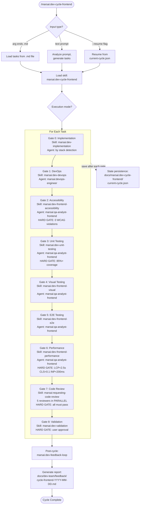
```mermaid
flowchart TD
    start(["/marsai:dev-cycle-frontend"])

    parse{"Input type?"}
    loadFile["Load tasks from .md file"]
    parsePrompt["Analyze prompt,<br/>generate tasks"]
    resumeState["Resume from<br/>current-cycle.json"]

    loadSkill["Load skill:<br/>marsai:dev-cycle-frontend"]

    askMode{"Execution mode?"}

    start --> parse
    parse -->|"arg ends .md"| loadFile
    parse -->|"text prompt"| parsePrompt
    parse -->|"--resume flag"| resumeState
    loadFile --> loadSkill
    parsePrompt --> loadSkill
    resumeState --> loadSkill
    loadSkill --> askMode

    subgraph PerTask["For Each Task"]
        g0["Gate 0: Implementation<br/>Skill: marsai:dev-implementation<br/>Agent: by stack detection"]
        g1["Gate 1: DevOps<br/>Skill: marsai:dev-devops<br/>Agent: marsai:devops-engineer"]
        g2["Gate 2: Accessibility<br/>Skill: marsai:dev-frontend-accessibility<br/>Agent: marsai:qa-analyst-frontend<br/>HARD GATE: 0 WCAG violations"]
        g3["Gate 3: Unit Testing<br/>Skill: marsai:dev-unit-testing<br/>Agent: marsai:qa-analyst-frontend<br/>HARD GATE: 85%+ coverage"]
        g4["Gate 4: Visual Testing<br/>Skill: marsai:dev-frontend-visual<br/>Agent: marsai:qa-analyst-frontend"]
        g5["Gate 5: E2E Testing<br/>Skill: marsai:dev-frontend-e2e<br/>Agent: marsai:qa-analyst-frontend"]
        g6["Gate 6: Performance<br/>Skill: marsai:dev-frontend-performance<br/>Agent: marsai:qa-analyst-frontend<br/>HARD GATE: LCP<2.5s CLS<0.1 INP<200ms"]
        g7["Gate 7: Code Review<br/>Skill: marsai:requesting-code-review<br/>5 reviewers in PARALLEL<br/>HARD GATE: all must pass"]
        g8["Gate 8: Validation<br/>Skill: marsai:dev-validation<br/>HARD GATE: user approval"]

        g0 --> g1 --> g2 --> g3 --> g4
        g4 --> g5 --> g6 --> g7 --> g8
    end

    askMode --> PerTask

    g8 --> feedback["Post-cycle:<br/>marsai:dev-feedback-loop"]
    feedback --> report["Generate report:<br/>docs/dev-team/feedback/<br/>cycle-frontend-YYYY-MM-DD.md"]
    report --> done([Cycle Complete])

    state["State persistence:<br/>docs/marsai:dev-cycle-frontend/<br/>current-cycle.json"]
    PerTask -.->|"save after each gate"| state
```

### 4.3 /marsai:dev-refactor (Backend Analysis + Execution)

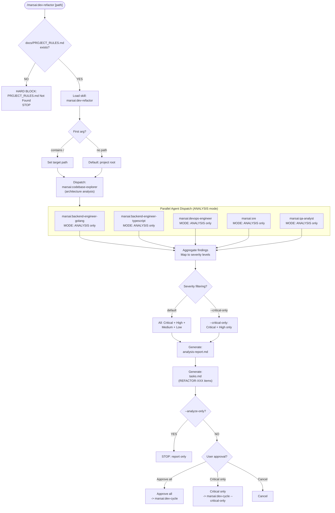
```mermaid
flowchart TD
    start(["/marsai:dev-refactor [path]"])

    precheck{"docs/PROJECT_RULES.md<br/>exists?"}
    block["HARD BLOCK:<br/>PROJECT_RULES.md Not Found<br/>STOP"]

    loadSkill["Load skill:<br/>marsai:dev-refactor"]

    parseArgs{"First arg?"}
    pathArg["Set target path"]
    defaultPath["Default: project root"]

    explore["Dispatch:<br/>marsai:codebase-explorer<br/>(architecture analysis)"]

    subgraph ParallelAnalysis["Parallel Agent Dispatch (ANALYSIS mode)"]
        a1["marsai:backend-engineer-golang<br/>MODE: ANALYSIS only"]
        a2["marsai:backend-engineer-typescript<br/>MODE: ANALYSIS only"]
        a3["marsai:devops-engineer<br/>MODE: ANALYSIS only"]
        a4["marsai:sre<br/>MODE: ANALYSIS only"]
        a5["marsai:qa-analyst<br/>MODE: ANALYSIS only"]
    end

    aggregate["Aggregate findings<br/>Map to severity levels"]

    severity{"Severity filtering?"}
    allFindings["All: Critical + High +<br/>Medium + Low"]
    criticalOnly["--critical-only:<br/>Critical + High only"]

    generateReport["Generate:<br/>analysis-report.md"]
    generateTasks["Generate:<br/>tasks.md<br/>(REFACTOR-XXX items)"]

    analyzeOnly{"--analyze-only?"}
    stopHere["STOP: report only"]

    approval{"User approval?"}
    approveAll["Approve all<br/>-> marsai:dev-cycle"]
    approveCritical["Critical only<br/>-> marsai:dev-cycle --critical-only"]
    cancel["Cancel"]

    start --> precheck
    precheck -->|"YES"| loadSkill
    precheck -->|"NO"| block
    loadSkill --> parseArgs
    parseArgs -->|"contains /"| pathArg
    parseArgs -->|"no path"| defaultPath
    pathArg --> explore
    defaultPath --> explore
    explore --> ParallelAnalysis
    a1 & a2 & a3 & a4 & a5 --> aggregate
    aggregate --> severity
    severity -->|"default"| allFindings
    severity -->|"--critical-only"| criticalOnly
    allFindings --> generateReport
    criticalOnly --> generateReport
    generateReport --> generateTasks
    generateTasks --> analyzeOnly
    analyzeOnly -->|"YES"| stopHere
    analyzeOnly -->|"NO"| approval
    approval -->|"Approve all"| approveAll
    approval -->|"Critical only"| approveCritical
    approval -->|"Cancel"| cancel
```

### 4.4 /marsai:dev-refactor-frontend (Frontend Analysis + Execution)

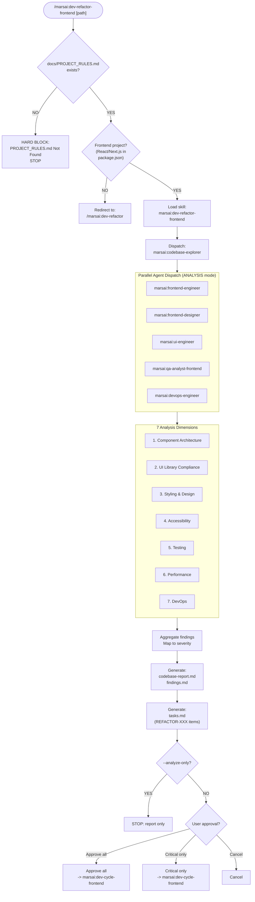
```mermaid
flowchart TD
    start(["/marsai:dev-refactor-frontend [path]"])

    precheck{"docs/PROJECT_RULES.md<br/>exists?"}
    block["HARD BLOCK:<br/>PROJECT_RULES.md Not Found<br/>STOP"]

    feCheck{"Frontend project?<br/>(React/Next.js in<br/>package.json)"}
    redirect["Redirect to:<br/>/marsai:dev-refactor"]

    loadSkill["Load skill:<br/>marsai:dev-refactor-frontend"]

    explore["Dispatch:<br/>marsai:codebase-explorer"]

    subgraph ParallelAnalysis["Parallel Agent Dispatch (ANALYSIS mode)"]
        direction LR
        a1["marsai:frontend-engineer"]
        a2["marsai:frontend-designer"]
        a3["marsai:ui-engineer"]
        a4["marsai:qa-analyst-frontend"]
        a5["marsai:devops-engineer"]
    end

    subgraph Dimensions["7 Analysis Dimensions"]
        d1["1. Component Architecture"]
        d2["2. UI Library Compliance"]
        d3["3. Styling & Design"]
        d4["4. Accessibility"]
        d5["5. Testing"]
        d6["6. Performance"]
        d7["7. DevOps"]
    end

    aggregate["Aggregate findings<br/>Map to severity"]

    generateReport["Generate:<br/>codebase-report.md<br/>findings.md"]
    generateTasks["Generate:<br/>tasks.md<br/>(REFACTOR-XXX items)"]

    analyzeOnly{"--analyze-only?"}
    stopHere["STOP: report only"]

    approval{"User approval?"}
    approveAll["Approve all<br/>-> marsai:dev-cycle-frontend"]
    approveCritical["Critical only<br/>-> marsai:dev-cycle-frontend"]
    cancel["Cancel"]

    start --> precheck
    precheck -->|"YES"| feCheck
    precheck -->|"NO"| block
    feCheck -->|"YES"| loadSkill
    feCheck -->|"NO"| redirect
    loadSkill --> explore
    explore --> ParallelAnalysis
    ParallelAnalysis --> Dimensions
    Dimensions --> aggregate
    aggregate --> generateReport --> generateTasks
    generateTasks --> analyzeOnly
    analyzeOnly -->|"YES"| stopHere
    analyzeOnly -->|"NO"| approval
    approval -->|"Approve all"| approveAll
    approval -->|"Critical only"| approveCritical
    approval -->|"Cancel"| cancel
```

### 4.5 /marsai:dev-status

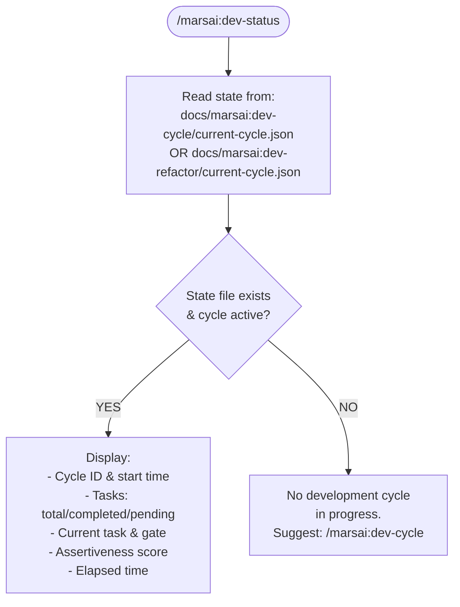
```mermaid
flowchart TD
    start(["/marsai:dev-status"])

    readState["Read state from:<br/>docs/marsai:dev-cycle/current-cycle.json<br/>OR docs/marsai:dev-refactor/current-cycle.json"]

    exists{"State file exists<br/>& cycle active?"}

    display["Display:<br/>- Cycle ID & start time<br/>- Tasks: total/completed/pending<br/>- Current task & gate<br/>- Assertiveness score<br/>- Elapsed time"]

    noState["No development cycle<br/>in progress.<br/>Suggest: /marsai:dev-cycle"]

    start --> readState --> exists
    exists -->|"YES"| display
    exists -->|"NO"| noState
```

### 4.6 /marsai:dev-cancel

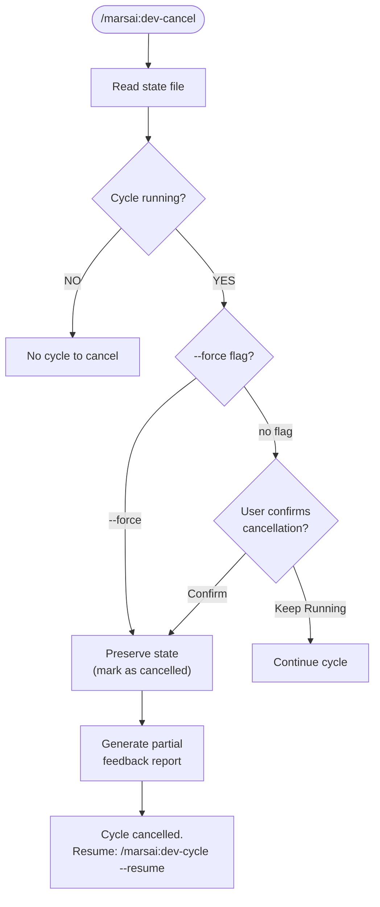
```mermaid
flowchart TD
    start(["/marsai:dev-cancel"])

    readState["Read state file"]

    exists{"Cycle running?"}
    noState["No cycle to cancel"]

    forceCheck{"--force flag?"}
    confirm{"User confirms<br/>cancellation?"}

    preserve["Preserve state<br/>(mark as cancelled)"]
    partialReport["Generate partial<br/>feedback report"]
    done["Cycle cancelled.<br/>Resume: /marsai:dev-cycle --resume"]

    start --> readState --> exists
    exists -->|"NO"| noState
    exists -->|"YES"| forceCheck
    forceCheck -->|"--force"| preserve
    forceCheck -->|"no flag"| confirm
    confirm -->|"Confirm"| preserve
    confirm -->|"Keep Running"| keepRunning["Continue cycle"]
    preserve --> partialReport --> done
```

### 4.7 /marsai:dev-report

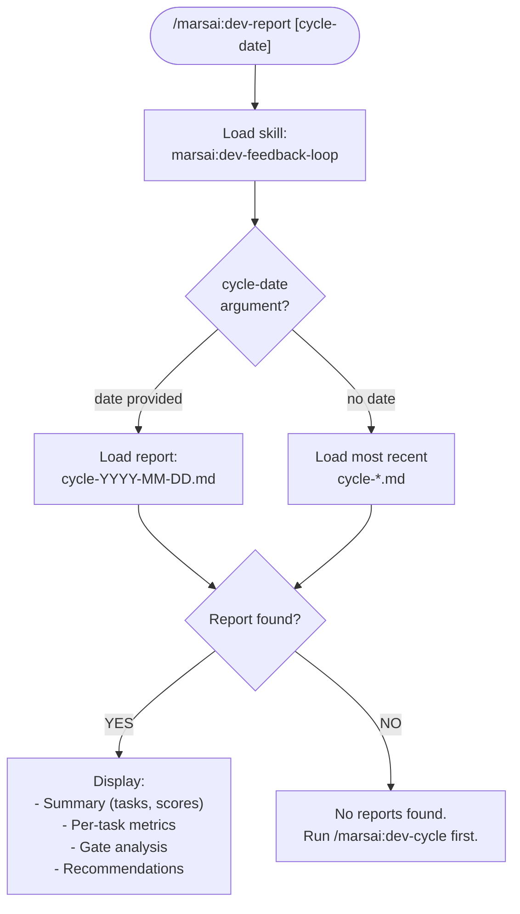
```mermaid
flowchart TD
    start(["/marsai:dev-report [cycle-date]"])

    loadSkill["Load skill:<br/>marsai:dev-feedback-loop"]

    dateCheck{"cycle-date<br/>argument?"}
    specific["Load report:<br/>cycle-YYYY-MM-DD.md"]
    latest["Load most recent<br/>cycle-*.md"]

    exists{"Report found?"}
    noReport["No reports found.<br/>Run /marsai:dev-cycle first."]

    display["Display:<br/>- Summary (tasks, scores)<br/>- Per-task metrics<br/>- Gate analysis<br/>- Recommendations"]

    start --> loadSkill --> dateCheck
    dateCheck -->|"date provided"| specific
    dateCheck -->|"no date"| latest
    specific --> exists
    latest --> exists
    exists -->|"YES"| display
    exists -->|"NO"| noReport
```

---

## 5. Gate 0 Agent Dispatch Logic

The most complex decision tree in the system. `marsai:dev-implementation` selects the agent based on project language and context.

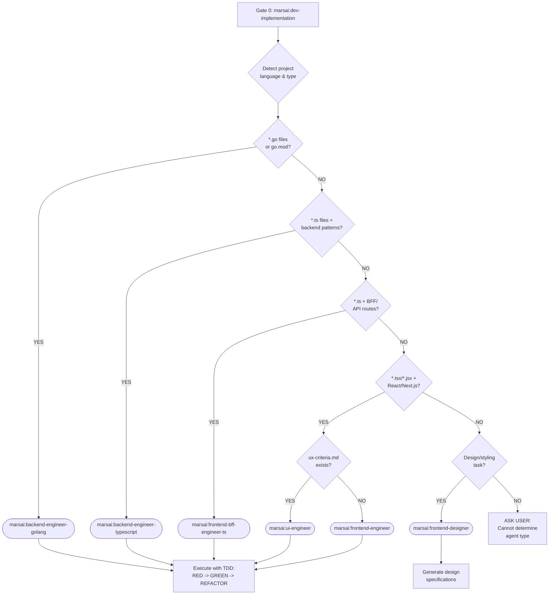
```mermaid
flowchart TD
    gate0["Gate 0: marsai:dev-implementation"]

    detect{"Detect project<br/>language & type"}

    goCheck{"*.go files<br/>or go.mod?"}
    tsCheck{"*.ts files +<br/>backend patterns?"}
    bffCheck{"*.ts + BFF/<br/>API routes?"}
    reactCheck{"*.tsx/*.jsx +<br/>React/Next.js?"}
    uxCheck{"ux-criteria.md<br/>exists?"}
    designCheck{"Design/styling<br/>task?"}
    askUser["ASK USER:<br/>Cannot determine<br/>agent type"]

    goAgent(["marsai:backend-engineer-golang"])
    tsAgent(["marsai:backend-engineer-typescript"])
    bffAgent(["marsai:frontend-bff-engineer-ts"])
    feAgent(["marsai:frontend-engineer"])
    uiAgent(["marsai:ui-engineer"])
    designAgent(["marsai:frontend-designer"])

    tdd["Execute with TDD:<br/>RED -> GREEN -> REFACTOR"]
    specs["Generate design<br/>specifications"]

    gate0 --> detect
    detect --> goCheck
    goCheck -->|"YES"| goAgent
    goCheck -->|"NO"| tsCheck
    tsCheck -->|"YES"| tsAgent
    tsCheck -->|"NO"| bffCheck
    bffCheck -->|"YES"| bffAgent
    bffCheck -->|"NO"| reactCheck
    reactCheck -->|"YES"| uxCheck
    uxCheck -->|"YES"| uiAgent
    uxCheck -->|"NO"| feAgent
    reactCheck -->|"NO"| designCheck
    designCheck -->|"YES"| designAgent
    designCheck -->|"NO"| askUser

    goAgent & tsAgent & bffAgent & feAgent & uiAgent --> tdd
    designAgent --> specs
```

---

## 6. Agent Handoff Contracts

Data flows between agents during the development cycle.

```mermaid
flowchart LR
    subgraph DesignPhase["Design Phase"]
        designer(["marsai:frontend-designer"])
    end

    subgraph DesignArtifacts["Design Artifacts"]
        ux["ux-criteria.md"]
        flows["user-flows.md"]
        wire["wireframes/ (YAML)"]
        handoff["Handoff Contract:<br/>1. Component Tree<br/>2. Design Tokens<br/>3. Responsive Rules<br/>4. Interaction States<br/>5. Accessibility Notes<br/>6. Content Specs<br/>7. Animation Specs<br/>8. Edge Cases"]
    end

    subgraph ImplementPhase["Implementation Phase"]
        uiEng(["marsai:ui-engineer"])
        feEng(["marsai:frontend-engineer"])
    end

    designer --> ux & flows & wire & handoff
    ux & flows & wire -->|"MANDATORY input"| uiEng
    handoff -->|"design specs"| feEng

    subgraph BFFPhase["BFF Phase"]
        bff(["marsai:frontend-bff-engineer-ts"])
    end

    subgraph BFFArtifacts["BFF Artifacts"]
        contract["BFF API Contract:<br/>- Endpoint types<br/>- Request/Response DTOs<br/>- Error codes"]
    end

    bff --> contract
    contract -->|"API routes"| feEng

    subgraph BackendPhase["Backend Phase"]
        goEng(["marsai:backend-engineer-golang"])
        tsEng(["marsai:backend-engineer-typescript"])
    end

    subgraph BackendArtifacts["Backend Artifacts"]
        implSummary["implementation_summary:<br/>- Files changed<br/>- Endpoints created<br/>- Dependencies added"]
    end

    subgraph InfraPhase["Infrastructure Phase"]
        devops(["marsai:devops-engineer"])
        sre(["marsai:sre"])
    end

    goEng & tsEng --> implSummary
    implSummary -->|"for containerization"| devops
    goEng & tsEng -->|"observability code<br/>for validation"| sre
```

---

## Quick Reference: Standards File Mapping

| Agent | Standards File | Sections |
|-------|---------------|----------|
| marsai:backend-engineer-golang | golang.md | 47 |
| marsai:backend-engineer-typescript | typescript.md | 14 |
| marsai:frontend-bff-engineer-ts | typescript.md | 14 core + 6 BFF |
| marsai:frontend-engineer | frontend.md | 19 |
| marsai:frontend-designer | frontend.md | 19 |
| marsai:ui-engineer | frontend.md | 19 |
| marsai:devops-engineer | devops.md | 8 |
| marsai:sre | sre.md | 6 |
| marsai:qa-analyst | golang.md or typescript.md | varies |
| marsai:qa-analyst-frontend | frontend.md | 19 |
| marsai:prompt-quality-reviewer | (none) | - |

## Quick Reference: Shared Patterns Used

| Shared Pattern | Used By |
|---------------|---------|
| standards-workflow.md | All implementation agents |
| standards-coverage-table.md | All agents |
| standards-compliance-detection.md | All agents (when ANALYSIS mode) |
| standards-boundary-enforcement.md | golang, bff-ts, designer |
| shared-anti-rationalization.md | All implementation agents |
| ai-slop-detection.md | golang, ts, bff-ts, devops, frontend-engineer |
| shared-orchestrator-principle.md | Orchestrator skills only |
| shared-pressure-resistance.md | All skills |
| template-tdd-prompts.md | dev-implementation, dev-unit-testing |
| custom-prompt-validation.md | dev-cycle, dev-cycle-frontend |
| output-execution-report.md | dev-cycle, dev-cycle-frontend |
| shared-red-flags.md | dev-refactor, dev-refactor-frontend |
| anti-rationalization-codebase-explorer.md | dev-refactor, dev-refactor-frontend |
