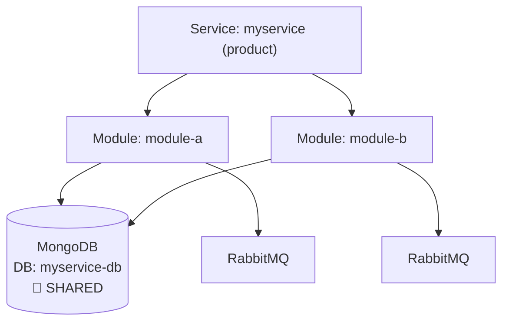
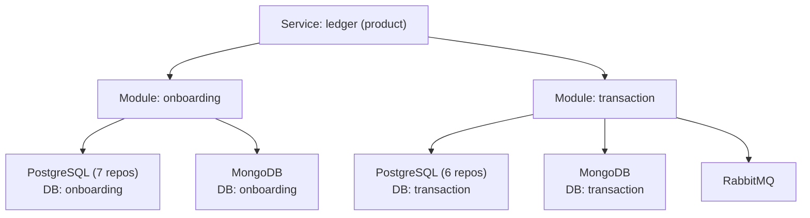

# Service Discovery for Tenant-Manager

Scans the current project and produces a visual report of the **Service → Module → Resource** hierarchy. This report tells you exactly what needs to be registered in the tenant-manager (pool-manager) to provision tenants for this service.

---

## How It Works

The tenant-manager has three entities that must be registered before provisioning tenants:

1. **Service** — the application (e.g., "ledger", "plugin-crm"). Has a type: `product` or `plugin`.
2. **Module** — a logical grouping within the service (e.g., "onboarding", "transaction"). Each module gets its own database pool per tenant.
3. **Resource** — infrastructure a module needs: `postgresql`, `mongodb`, or `rabbitmq`. Each resource gets provisioned per tenant per module.

Redis is **not** a tenant-manager resource — it uses key prefixing via `GetKeyContext` and does not need registration.

---

## Phase 1: Service Detection

**Orchestrator executes directly. No agent dispatch.**

```text
Detect service identity (run in parallel):

1. Service name:
   - Grep tool: pattern "const ApplicationName" in internal/bootstrap/ cmd/ --include="*.go"
   - Extract the string value (e.g., "ledger", "plugin-crm", "onboarding")

2. Service type:
   - Read go.mod first line (module path)
   - If module path contains "plugin-" → serviceType = "plugin"
   - Else → serviceType = "product"

3. Project structure:
   - Glob tool: pattern "components/*/cmd/app/main.go"
   - If multiple matches → unified service with multiple components (like ledger)
   - If no matches → Glob: "cmd/app/main.go" or "cmd/*/main.go" → single-component service

4. Unified service detection (if multiple components found):
   - Glob tool: pattern "components/*/internal/bootstrap/config.go"
   - For each component, grep "const ApplicationName" → collect module names
   - Check if a "parent" component imports and composes the others
     (grep "InitServiceWithOptions\|InitServersWithOptions" in each component's bootstrap)
   - The parent component's ApplicationName = service name
   - Each child component's ApplicationName = module name

Store results:
  service_name = "{detected name}"
  service_type = "product" | "plugin"
  is_unified = true | false
  components = [{name, path, applicationName}]  // if unified
```

---

## Phase 2: Module Detection

```text
Detect modules (run in parallel):

Strategy A — Explicit WithModule calls (preferred):
   - Grep tool: pattern "WithModule\(" in internal/ components/ --include="*.go"
   - Extract module names from the string argument: WithModule("onboarding") → "onboarding"
   - Deduplicate (same module name used in tmpostgres, tmmongo, tmrabbitmq = one module)

Strategy B — Component-based (if no WithModule found):
   - Each component with its own internal/bootstrap/ and ApplicationName = one module
   - module_name = ApplicationName of that component

Strategy C — Single-component service (no components/ directory):
   - module_name = service ApplicationName
   - This service has exactly 1 module

Merge strategies (A takes precedence, B fills gaps, C is fallback):
  modules = [
    {name: "onboarding", component_path: "components/onboarding/"},
    {name: "transaction", component_path: "components/transaction/"},
  ]
  // or for single-component:
  modules = [
    {name: "my-service", component_path: "./"}
  ]
```

---

## Phase 3: Resource Detection per Module

```text
For EACH detected module, scan its adapter directory:

base_path = module.component_path + "internal/adapters/"
// For single-component: base_path = "internal/adapters/"

Detect resources (run in parallel per module):

1. PostgreSQL:
   - Glob tool: pattern "{base_path}postgres/*" (directories)
   - If any subdirectory exists → resource "postgresql" detected
   - Count subdirectories = repository count
   - List subdirectory names = repository names (e.g., "organization", "ledger", "account")

2. MongoDB:
   - Glob tool: pattern "{base_path}mongodb/*" OR "{base_path}mongo/*" (directories)
   - If any subdirectory or file exists → resource "mongodb" detected
   - Note: metadata repositories use collection-per-entity pattern

3. RabbitMQ:
   - Glob tool: pattern "{base_path}rabbitmq/*" (files)
   - If any file exists → resource "rabbitmq" detected
   - Grep: "producer\|Producer" in matched files → has producer
   - Grep: "consumer\|Consumer" in matched files → has consumer
   - Grep: "QUEUE\|queue" in the module's bootstrap config → extract queue names

4. Redis (informational only — NOT a tenant-manager resource):
   - Glob tool: pattern "{base_path}redis/*" (files)
   - If exists → note "Redis detected — managed via key prefixing, no tenant-manager registration needed"

Store per module:
  module.resources = [
    {type: "postgresql", repos: ["organization", "ledger", ...], count: 7},
    {type: "mongodb", collections_info: "metadata (collection-per-entity)"},
    {type: "rabbitmq", has_producer: true, has_consumer: true, queues: ["BTO"]},
  ]
  module.redis_detected = true | false  // informational only
```

---

## Phase 3.5: Database Name Detection per Module

```text
For EACH detected module, extract the actual database names from configuration:

config_path = module.component_path + "internal/bootstrap/config.go"
env_path    = module.component_path + ".env.example"
// For single-component: config_path = "internal/bootstrap/config.go", env_path = ".env.example"

DETECT database names (run in parallel per module):

1. Bootstrap config struct (source of truth for env var names):
   - Read config_path
   - Grep for env tags matching database name patterns:
     a. PostgreSQL: env:"DB_NAME" or env:"DB_<MODULE_UPPER>_NAME"
     b. MongoDB:    env:"MONGO_NAME" or env:"MONGO_<MODULE_UPPER>_NAME"
   - Extract the Go struct field name and env var name
   - Note: Prefixed variants (DB_<MODULE>_NAME) are used in unified services
     where a parent component composes child modules (e.g., ledger composing
     onboarding + transaction). Non-prefixed (DB_NAME) is the standard form.

2. .env.example (source of truth for default values):
   - Read env_path
   - For each env var name found in step 1, extract the default value:
     a. PostgreSQL: DB_NAME=<value> or DB_<MODULE_UPPER>_NAME=<value>
     b. MongoDB:    MONGO_NAME=<value> or MONGO_<MODULE_UPPER>_NAME=<value>
   - These are the actual database names used in development

3. External datasources (DATASOURCE_* pattern):
   - Grep in env_path for: DATASOURCE_*_DATABASE=<value>
   - Each match = one external database connection
   - Extract: datasource name (from env var), database name (from value), type (from DATASOURCE_*_TYPE)
   - These represent read-only connections to OTHER services' databases

4. Fallback (if .env.example not found or value empty):
   - Use the module name as likely database name (common convention)
   - Flag as "inferred — verify manually"

Store per module:
  module.databases = {
    postgresql: {env_var: "DB_NAME", default_value: "onboarding", source: ".env.example"},
    mongodb:    {env_var: "MONGO_NAME", default_value: "onboarding", source: ".env.example"},
  }
  module.external_datasources = [
    {name: "onboarding", env_prefix: "DATASOURCE_ONBOARDING", database: "onboarding", type: "postgresql"},
  ]
```

---

## Phase 3.6: Shared Database Detection (Cross-Module Analysis)

```text
AFTER all modules have been scanned (Phases 3 + 3.5 complete), cross-reference
database names across ALL modules to detect shared databases.

This is CRITICAL for tenant-manager: when two modules point to the same database,
tenant-manager must provision ONE database (not two) and grant access to both modules.

DETECT shared databases:

1. Internal databases (same DB name across modules):
   - Group all module.databases entries by (resource_type, default_value)
   - If 2+ modules share the same (type, db_name) → mark as SHARED
   - Example: module-a.mongodb.default_value == module-b.mongodb.default_value == "myservice-db"
     → shared_databases.mongodb["myservice-db"] = ["module-a", "module-b"]
   - Example: module-a.postgresql.default_value == module-b.postgresql.default_value == "myservice"
     → shared_databases.postgresql["myservice"] = ["module-a", "module-b"]

2. External datasources (same DATASOURCE_*_DATABASE across modules):
   - Group all module.external_datasources by (database, type)
   - If 2+ modules reference the same external DB → mark as SHARED
   - Example: module-a and module-b both have DATASOURCE_FOO_DATABASE=foo
     → shared_external["foo"] = ["module-a", "module-b"]

TENANT-MANAGER IMPLICATIONS (include in report):

For shared MongoDB:
  - Tenant-manager provisions ONE MongoDB database per tenant
  - Both modules receive their own credentials to the SAME tenant database
  - Collections are shared — both modules read/write the same collections

For shared PostgreSQL:
  - Tenant-manager provisions ONE PostgreSQL database per tenant
  - Both modules connect to the SAME database
  - Each module may use the same schema or have its own schema within the
    shared database (depends on service design — check DATASOURCE_*_SCHEMAS)
  - Tenant-manager creates the schema(s) with tables inside the single database
  - Each module gets its own credentials with appropriate schema access

The registration checklist must list the database ONCE with all modules
that access it. DO NOT create duplicate databases.

Store results:
  shared_databases = {
    mongodb: {
      "myservice-db": {modules: ["module-a", "module-b"], provision_once: true}
    },
    postgresql: {
      // empty if no shared PG databases detected in this example
    }
  }
  shared_external = {
    "foo": {modules: ["module-a", "module-b"], type: "postgresql"}
  }
```

---

## Phase 3.7: MongoDB Index Detection & Script Generation

**Only execute this phase if MongoDB was detected in any module during Phase 3.**

**Read the full reference:** `references/mongodb-index-detection.md` (in this skill's directory)

Summary of steps:
1. **Detect in-code indexes** — scan `EnsureIndexes()` / `IndexModel{}` in MongoDB adapter files
2. **Detect existing scripts** — scan `scripts/mongodb/*.js` for `createIndex` calls
3. **Cross-reference** — match in-code indexes against script indexes (covered / missing_script / script_only)
4. **Generate missing scripts** — create `mongosh`-compatible `.js` scripts following the idempotent `createIndexSafely` pattern (see reference for full template)
5. **Upload to S3** — asks which bucket to use, then uploads scripts following the migrations bucket convention: `s3://{bucket}/{service}/{module}/mongodb/` (requires valid AWS credentials; verify with `aws sts get-caller-identity`). S3 upload failures are non-blocking — skill continues to Phase 4 with upload status reported in the HTML report

Store results for Phase 4 report:
```text
  index_coverage = {
    covered: [{collection, keys, in_code_file, script_file}],
    missing_script: [{collection, keys, in_code_file}],
    script_only: [{collection, keys, script_file}],
  }
```

---

## Phase 4: Generate Visual Report

**MANDATORY: Invoke `Skill("ring:visual-explainer")` to produce the report.**

Read `default/skills/visual-explainer/templates/data-table.html` first to absorb table patterns.

**The report is focused on what needs to be configured in the tenant-manager for multi-tenant to work for this service.**

**The HTML report MUST include these sections:**

### 1. Tenant-Manager Configuration Summary

Card showing:
- **Service Name:** `{service_name}`
- **Service Type:** `product` | `plugin`
- **Modules:** `{count}`
- **Total Resources:** `{count across all modules}`
- **Shared Databases:** `{count}` (databases accessed by 2+ modules — provision once)
- **External Datasources:** `{count}` (read-only connections to other services)

```markdown
## Tenant-Manager Configuration for: {service_name}

One card per module. When a resource is shared with another module, display a
**SHARED** badge and list the other modules that access it.

**Example A — Shared database (two modules pointing to the same DB):**

```
┌─────────────────────────────────────────────────┐
│ MODULE: module-a                                │
├─────────────────────────────────────────────────┤
│ MongoDB ✅                                      │
│   DB name: "myservice-db" (MONGO_NAME)          │
│   🔗 SHARED DB with: module-b                  │
│   ⚠ Provision ONCE — both modules get           │
│     credentials to the same tenant database     │
│                                                 │
│ RabbitMQ ✅  (producer)                         │
└─────────────────────────────────────────────────┘

┌─────────────────────────────────────────────────┐
│ MODULE: module-b                                │
├─────────────────────────────────────────────────┤
│ MongoDB ✅                                      │
│   DB name: "myservice-db" (MONGO_NAME)          │
│   🔗 SHARED DB with: module-a                  │
│   ⚠ Provision ONCE — see module-a               │
│                                                 │
│ RabbitMQ ✅  (consumer)                         │
└─────────────────────────────────────────────────┘
```

**Example B — Separate databases (ledger-style: each module has its own DB):**

```
┌──────────────────────────────────────────┐
│ MODULE: onboarding                       │
├──────────────────────────────────────────┤
│ PostgreSQL ✅  (7 repositories)          │
│   DB name: "onboarding" (DB_NAME)        │
│   organization, ledger, account,         │
│   asset, portfolio, segment,             │
│   accounttype                            │
│                                          │
│ MongoDB ✅  (metadata)                   │
│   DB name: "onboarding" (MONGO_NAME)     │
└──────────────────────────────────────────┘
```

**Database name display rules:**
- Show the default value from `.env.example` in quotes
- Show the env var name in parentheses for reference
- If inferred (no `.env.example`), show with "(inferred)" suffix
- External datasources appear in a separate sub-section per module
- **SHARED databases** get a `🔗 SHARED DB with: <modules>` line and a `⚠ Provision ONCE` warning

### 2. MongoDB Index Scripts

Table showing what scripts exist and where they are:

```
| Script                       | Module      | Indexes | S3 Status  | S3 Path                                       |
|------------------------------|-------------|---------|------------|-----------------------------------------------|
| create-metadata-indexes.js   | onboarding  | 7       | ✅ Uploaded | s3://{bucket}/{service}/onboarding/mongodb/    |
| create-metadata-indexes.js   | transaction | 4       | ✅ Uploaded | s3://{bucket}/{service}/transaction/mongodb/   |
| create-audit-indexes.js      | transaction | 2       | ⚠️ Missing  | (generated locally, not yet uploaded)          |
```

If there are indexes in code without scripts:
```
⚠️  {N} indexes detected in code without corresponding scripts.
    Scripts were generated in scripts/mongodb/ — upload to S3 at
    s3://{bucket}/{service}/{module}/mongodb/ to make them available
    for dedicated tenant database provisioning.
```

### 2.5. Shared Databases Summary

**Only display this section if shared databases were detected in Phase 3.6.**

Table format:

```
| DB Type     | Database Name    | Shared By              | Provision Strategy              |
|-------------|------------------|------------------------|---------------------------------|
| MongoDB     | "myservice-db"   | module-a, module-b     | 1 database, 2 credential sets   |
| PostgreSQL  | "myservice"      | module-x, module-y     | 1 database, shared schema       |
```

**Provision strategy explanations:**
- **1 database, N credential sets** — tenant-manager creates ONE database per tenant; each module gets its own credentials to the same DB. For MongoDB: shared collections. For PostgreSQL: shared schema or separate schemas within the same database.
- **1 database, separate schemas** — when 2 modules share a PostgreSQL DB but use different schemas, tenant-manager creates ONE database with all schemas inside; each module accesses its own schema with its own credentials
- **Read-only, shared credentials** — external datasource (not tenant-managed); modules connect with the same read-only credentials

### 3. Service Hierarchy Diagram

Mermaid diagram. Shared databases use a single node with connections from multiple modules:

**Example A — Shared database (two modules, same DB):**



**Example B — Separate databases (ledger-style):**



**Diagram rules:**
- Shared databases use a SINGLE cylindrical node connected to ALL modules that access it
- Shared nodes include `🔗 SHARED` label
- Non-shared databases are drawn per module as before
- RabbitMQ is always drawn per module (no shared analysis needed for queues)

### 4. Tenant-Manager Registration Checklist

**Example A — With shared databases (two modules, same DB):**

```markdown
## What to register in tenant-manager:

- [ ] **Service:** `myservice` (type: product, isolation: database)

- [ ] **Module:** `module-a`
  - [ ] Resource: mongodb (DB: "myservice-db", env: MONGO_NAME)
        ⚠ SHARED DB with module-b — provision ONCE, grant access to both
  - [ ] Resource: rabbitmq

- [ ] **Module:** `module-b`
  - [ ] Resource: mongodb → SAME DB as module-a ("myservice-db")
        DO NOT create a second database — reuse module-a's
  - [ ] Resource: rabbitmq

## Shared databases (provision ONCE, access by multiple modules):
| DB Type  | Database Name   | Modules              | Action                        |
|----------|-----------------|----------------------|-------------------------------|
| mongodb  | "myservice-db"  | module-a, module-b   | 1 database, 2 credential sets |
```

**Example B — Without shared databases (ledger-style):**

```markdown
## What to register in tenant-manager:

- [ ] **Service:** `ledger` (type: product, isolation: database)

- [ ] **Module:** `onboarding`
  - [ ] Resource: postgresql (DB: "onboarding", env: DB_NAME)
  - [ ] Resource: mongodb (DB: "onboarding", env: MONGO_NAME)

- [ ] **Module:** `transaction`
  - [ ] Resource: postgresql (DB: "transaction", env: DB_NAME)
  - [ ] Resource: mongodb (DB: "transaction", env: MONGO_NAME)
  - [ ] Resource: rabbitmq
```

**Checklist rules:**
- Shared databases appear with `⚠ SHARED DB` warning on FIRST module and `→ SAME DB as <module>` reference on subsequent modules
- A dedicated "Shared databases" summary table lists all shared DBs with provisioning action
- External datasources note which modules access them
- MongoDB index S3 paths are listed per module when available

**Save to:** `docs/service-discovery.html` in the project root.

**Open in browser:**
```text
macOS: open docs/service-discovery.html
Linux: xdg-open docs/service-discovery.html
```

---

## Anti-Rationalization Table

| Rationalization | Why It's WRONG | Required Action |
|-----------------|----------------|-----------------|
| "I already know the modules" | Knowledge ≠ evidence. The scan catches things you miss. | **Run the scan** |
| "This service is simple, just one module" | Simple services may still have multiple resource types. | **Run the scan** |
| "Redis should be included as a resource" | Redis uses key prefixing (`GetKeyContext`), not per-tenant provisioning. It is not a tenant-manager resource. | **Exclude Redis from resources** |
| "The report doesn't need to be visual" | Visual reports are for human decision-making. A JSON dump is not actionable. | **Generate HTML via ring:visual-explainer** |
| "WithModule not found, so no modules" | Fall back to component structure or ApplicationName. A service always has at least one module. | **Use Strategy B or C** |
| "No index scripts needed, EnsureIndexes handles it" | In-code indexes run at app startup — but only if the app has connected. Scripts are needed for pre-provisioning, CI/CD, and dedicated tenant databases where the app hasn't booted yet. | **Generate scripts for all in-code indexes** |
| "I'll just run the indexes manually" | Manual index creation is error-prone and not reproducible. Scripts are idempotent, documented, and version-controlled. | **Generate scripts** |
| "Same DB name = probably a mistake" | Multiple modules sharing a database is a deliberate architecture pattern. Two modules may read/write the same tables. Detect and flag it, don't ignore it. | **Run Phase 3.6 cross-module analysis** |
| "Each module gets its own database, always" | Not true. Two modules often share the same database (same tables, same schema). Creating duplicates breaks tenant isolation — tenant-manager must provision ONE database and grant both modules access. | **Detect shared databases and mark provision-once** |
| "Index names aren't needed, MongoDB auto-generates them" | Auto-generated names (e.g., `field_1`) are inconsistent across environments and break down migrations. The `.down.json` needs explicit names to drop indexes reliably. | **Every index in `.up.json` MUST have `"name": "idx_..."` in options. `.down.json` MUST reference the same names.** |
| "Key order in JSON doesn't matter" | MongoDB compound index key order determines query optimization (ESR rule). JSON key order in `.up.json` MUST match the `bson.D` order in Go source code. Wrong order = wrong index = degraded queries. | **Validate key order against code (Step 3.5 V2). Fix and re-upload if mismatched.** |
| "The S3 migrations are already there, skip validation" | Existing ≠ correct. S3 migrations may have missing names, wrong key order, or stale index counts. Step 3.5 validates all four dimensions before proceeding. | **Run Step 3.5 validation on ALL existing S3 migration files.** |

---

## Pressure Resistance

| User Says | This Is | Response |
|-----------|---------|----------|
| "Just tell me the modules, no report" | SCOPE_REDUCTION | "The visual report takes seconds and gives you a complete checklist for tenant-manager registration. Generating it." |
| "Include Redis as a resource" | SCOPE_EXPANSION | "Redis is managed via key prefixing and does not require tenant-manager registration. Excluding it." |
| "Skip the PostgreSQL repo count" | SCOPE_REDUCTION | "Repository count helps you understand the scope of each module. Including it." |
