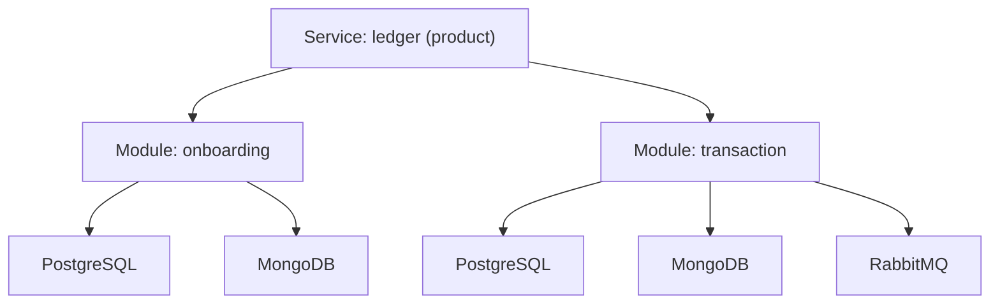

# Service Discovery for Tenant-Manager

Scans the current project and produces a visual report of the **Service → Module → Resource** hierarchy. This report tells you exactly what needs to be registered in the tenant-manager (pool-manager) to provision tenants for this service.

---

## How It Works

The tenant-manager has three entities that must be registered before provisioning tenants:

1. **Service** — the application (e.g., "ledger", "plugin-crm"). Has a type: `product` or `plugin`.
2. **Module** — a logical grouping within the service (e.g., "onboarding", "transaction"). Each module gets its own database pool per tenant.
3. **Resource** — infrastructure a module needs: `postgresql`, `mongodb`, or `rabbitmq`. Each resource gets provisioned per tenant per module.

Redis is **not** a tenant-manager resource — it uses key prefixing via `GetKeyFromContext` and does not need registration.

---

## Phase 1: Service Detection

**Orchestrator executes directly. No agent dispatch.**

```text
Detect service identity (run in parallel):

1. Service name:
   - Grep tool: pattern "const ApplicationName" in internal/bootstrap/ cmd/ --include="*.go"
   - Extract the string value (e.g., "ledger", "plugin-crm", "onboarding")

2. Service type:
   - Read go.mod first line (module path)
   - If module path contains "plugin-" → serviceType = "plugin"
   - Else → serviceType = "product"

3. Project structure:
   - Glob tool: pattern "components/*/cmd/app/main.go"
   - If multiple matches → unified service with multiple components (like ledger)
   - If no matches → Glob: "cmd/app/main.go" or "cmd/*/main.go" → single-component service

4. Unified service detection (if multiple components found):
   - Glob tool: pattern "components/*/internal/bootstrap/config.go"
   - For each component, grep "const ApplicationName" → collect module names
   - Check if a "parent" component imports and composes the others
     (grep "InitServiceWithOptions\|InitServersWithOptions" in each component's bootstrap)
   - The parent component's ApplicationName = service name
   - Each child component's ApplicationName = module name

Store results:
  service_name = "{detected name}"
  service_type = "product" | "plugin"
  is_unified = true | false
  components = [{name, path, applicationName}]  // if unified
```

---

## Phase 2: Module Detection

```text
Detect modules (run in parallel):

Strategy A — Explicit WithModule calls (preferred):
   - Grep tool: pattern "WithModule\(" in internal/ components/ --include="*.go"
   - Extract module names from the string argument: WithModule("onboarding") → "onboarding"
   - Deduplicate (same module name used in tmpostgres, tmmongo, tmrabbitmq = one module)

Strategy B — Component-based (if no WithModule found):
   - Each component with its own internal/bootstrap/ and ApplicationName = one module
   - module_name = ApplicationName of that component

Strategy C — Single-component service (no components/ directory):
   - module_name = service ApplicationName
   - This service has exactly 1 module

Merge strategies (A takes precedence, B fills gaps, C is fallback):
  modules = [
    {name: "onboarding", component_path: "components/onboarding/"},
    {name: "transaction", component_path: "components/transaction/"},
  ]
  // or for single-component:
  modules = [
    {name: "my-service", component_path: "./"}
  ]
```

---

## Phase 3: Resource Detection per Module

```text
For EACH detected module, scan its adapter directory:

base_path = module.component_path + "internal/adapters/"
// For single-component: base_path = "internal/adapters/"

Detect resources (run in parallel per module):

1. PostgreSQL:
   - Glob tool: pattern "{base_path}postgres/*" (directories)
   - If any subdirectory exists → resource "postgresql" detected
   - Count subdirectories = repository count
   - List subdirectory names = repository names (e.g., "organization", "ledger", "account")

2. MongoDB:
   - Glob tool: pattern "{base_path}mongodb/*" OR "{base_path}mongo/*" (directories)
   - If any subdirectory or file exists → resource "mongodb" detected
   - Note: metadata repositories use collection-per-entity pattern

3. RabbitMQ:
   - Glob tool: pattern "{base_path}rabbitmq/*" (files)
   - If any file exists → resource "rabbitmq" detected
   - Grep: "producer\|Producer" in matched files → has producer
   - Grep: "consumer\|Consumer" in matched files → has consumer
   - Grep: "QUEUE\|queue" in the module's bootstrap config → extract queue names

4. Redis (informational only — NOT a tenant-manager resource):
   - Glob tool: pattern "{base_path}redis/*" (files)
   - If exists → note "Redis detected — managed via key prefixing, no tenant-manager registration needed"

Store per module:
  module.resources = [
    {type: "postgresql", repos: ["organization", "ledger", ...], count: 7},
    {type: "mongodb", collections_info: "metadata (collection-per-entity)"},
    {type: "rabbitmq", has_producer: true, has_consumer: true, queues: ["BTO"]},
  ]
  module.redis_detected = true | false  // informational only
```

---

## Phase 3.5: MongoDB Index Detection & Script Generation

**Only execute this phase if MongoDB was detected in any module during Phase 3.**

**Read the full reference:** `references/mongodb-index-detection.md` (in this skill's directory)

Summary of steps:
1. **Detect in-code indexes** — scan `EnsureIndexes()` / `IndexModel{}` in MongoDB adapter files
2. **Detect existing scripts** — scan `scripts/mongodb/*.js` for `createIndex` calls
3. **Cross-reference** — match in-code indexes against script indexes (covered / missing_script / script_only)
4. **Generate missing scripts** — create `mongosh`-compatible `.js` scripts following the idempotent `createIndexSafely` pattern (see reference for full template)
5. **Upload to S3** — asks which bucket to use, then uploads scripts following the migrations bucket convention: `s3://{bucket}/{service}/{module}/mongodb/` (requires valid AWS credentials; verify with `aws sts get-caller-identity`). S3 upload failures are non-blocking — skill continues to Phase 4 with upload status reported in the HTML report

Store results for Phase 4 report:
```text
  index_coverage = {
    covered: [{collection, keys, in_code_file, script_file}],
    missing_script: [{collection, keys, in_code_file}],
    script_only: [{collection, keys, script_file}],
  }
```

---

## Phase 4: Generate Visual Report

**MANDATORY: Invoke `Skill("ring:visual-explainer")` to produce the report.**

Read `default/skills/visual-explainer/templates/data-table.html` first to absorb table patterns.

**The report is focused on what needs to be configured in the tenant-manager for multi-tenant to work for this service.**

**The HTML report MUST include these sections:**

### 1. Tenant-Manager Configuration Summary

The primary section — tells the operator exactly what to register:

```markdown
## Tenant-Manager Configuration for: {service_name}

Service: {service_name}
Type: {product | plugin}
Isolation: database

### Modules to Register

| Module       | PostgreSQL | MongoDB | RabbitMQ | MongoDB Indexes (S3)                          |
|--------------|------------|---------|----------|-----------------------------------------------|
| onboarding   | ✅ primary | ✅      | ❌       | s3://{bucket}/{service}/onboarding/mongodb/    |
| transaction  | ✅ primary | ✅      | ✅       | s3://{bucket}/{service}/transaction/mongodb/   |
```

For each module, show:
- Which resources need to be registered (postgresql, mongodb, rabbitmq)
- S3 path where MongoDB index scripts are available (if MongoDB detected)
- If index scripts were not uploaded yet, show: "⚠️ Not uploaded"

### 2. MongoDB Index Scripts

Table showing what scripts exist and where they are:

```
| Script                       | Module      | Indexes | S3 Status  | S3 Path                                       |
|------------------------------|-------------|---------|------------|-----------------------------------------------|
| create-metadata-indexes.js   | onboarding  | 7       | ✅ Uploaded | s3://{bucket}/{service}/onboarding/mongodb/    |
| create-metadata-indexes.js   | transaction | 4       | ✅ Uploaded | s3://{bucket}/{service}/transaction/mongodb/   |
| create-audit-indexes.js      | transaction | 2       | ⚠️ Missing  | (generated locally, not yet uploaded)          |
```

If there are indexes in code without scripts:
```
⚠️  {N} indexes detected in code without corresponding scripts.
    Scripts were generated in scripts/mongodb/ — upload to S3 at
    s3://{bucket}/{service}/{module}/mongodb/ to make them available
    for dedicated tenant database provisioning.
```

### 3. Service Hierarchy Diagram

Mermaid diagram showing Service → Module → Resource tree:



**Save to:** `docs/service-discovery.html` in the project root.

**Open in browser:**
```text
macOS: open docs/service-discovery.html
Linux: xdg-open docs/service-discovery.html
```

---

## Anti-Rationalization Table

| Rationalization | Why It's WRONG | Required Action |
|-----------------|----------------|-----------------|
| "I already know the modules" | Knowledge ≠ evidence. The scan catches things you miss. | **Run the scan** |
| "This service is simple, just one module" | Simple services may still have multiple resource types. | **Run the scan** |
| "Redis should be included as a resource" | Redis uses key prefixing (`GetKeyFromContext`), not per-tenant provisioning. It is not a tenant-manager resource. | **Exclude Redis from resources** |
| "The report doesn't need to be visual" | Visual reports are for human decision-making. A JSON dump is not actionable. | **Generate HTML via ring:visual-explainer** |
| "WithModule not found, so no modules" | Fall back to component structure or ApplicationName. A service always has at least one module. | **Use Strategy B or C** |
| "No index scripts needed, EnsureIndexes handles it" | In-code indexes run at app startup — but only if the app has connected. Scripts are needed for pre-provisioning, CI/CD, and dedicated tenant databases where the app hasn't booted yet. | **Generate scripts for all in-code indexes** |
| "I'll just run the indexes manually" | Manual index creation is error-prone and not reproducible. Scripts are idempotent, documented, and version-controlled. | **Generate scripts** |

---

## Pressure Resistance

| User Says | This Is | Response |
|-----------|---------|----------|
| "Just tell me the modules, no report" | SCOPE_REDUCTION | "The visual report takes seconds and gives you a complete checklist for tenant-manager registration. Generating it." |
| "Include Redis as a resource" | SCOPE_EXPANSION | "Redis is managed via key prefixing and does not require tenant-manager registration. Excluding it." |
| "Skip the PostgreSQL repo count" | SCOPE_REDUCTION | "Repository count helps you understand the scope of each module. Including it." |
