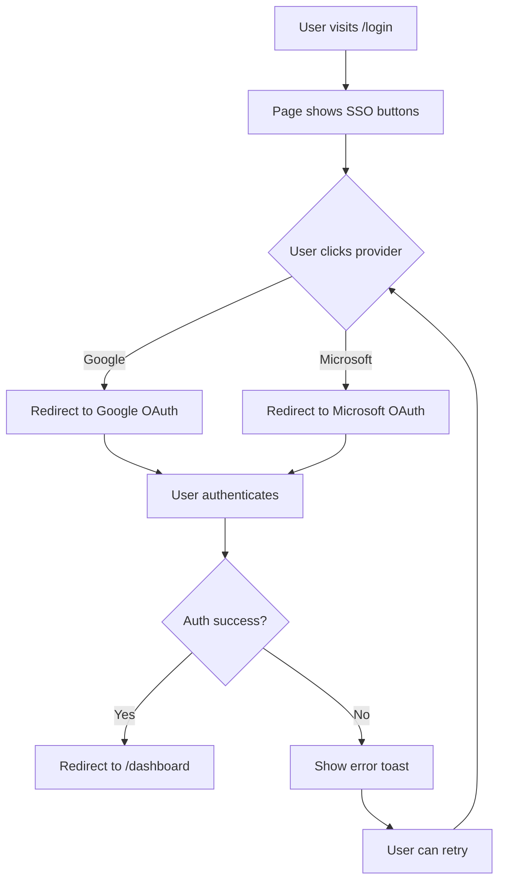

# User Flows

## Feature: SSO Login

## Flow 1: SSO Login (Happy Path)

### Steps:
1. User navigates to /login page
2. Page displays "Sign in with SSO" heading
3. Two provider buttons shown: Google, Microsoft
4. User clicks desired provider button
5. Button shows loading state (spinner)
6. System redirects to OAuth provider
7. User completes authentication
8. On success: redirect to /dashboard
9. On failure: show error toast with retry option

### Error Paths:
- **Provider unavailable**: Show error toast "Provider temporarily unavailable. Try another option."
- **Auth cancelled by user**: Return to login page, no error message
- **Token expired**: Show error toast "Session expired. Please try again."
- **Network error**: Show error toast "Connection failed. Check your internet."

### Edge Cases:
- User clicks provider, then clicks browser back → Return to login page
- User is already authenticated → Redirect directly to /dashboard
- Multiple rapid clicks on button → Debounce, only process first click
